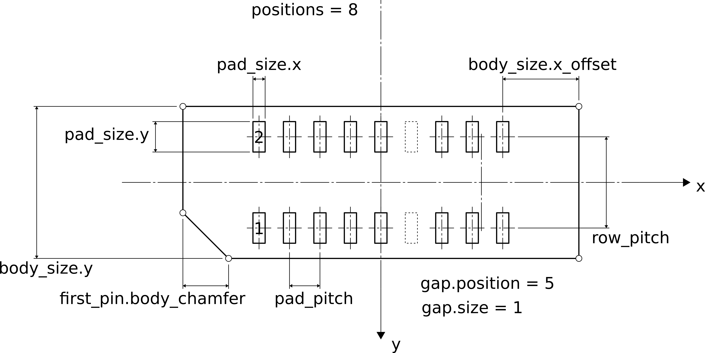
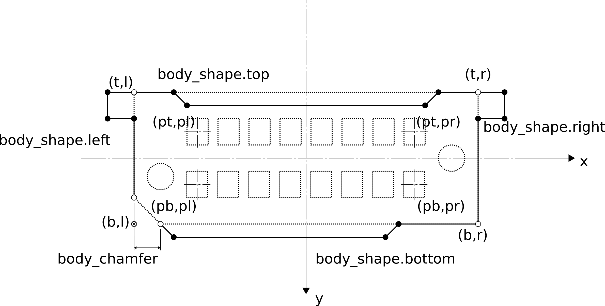

# Descripton of `connector_generator.py` YAML Files

The SMD Connector generator script can be run using
~~~shell
python3 ./connector_generator.py path_to/config_file_name.yaml
~~~

## YAML File Structure
The YAML configuration file supports inheritance. Using `inherit` allows to create 
versions of a part by just overwriting specific parameters. See the example below:

~~~yaml
defaults: # special target defaults is never interpreted as a connector specification
  library: 'Samtec_MicroPower'
  positions: [2, 3, 4, 5, 6, 7, 8, 9, 10]
  pad_pitch: 2.0
  first_pin:
    marker:
      shape: 'triangle' # shape of pin 1 marker on Silk and Fab (circle or triangle)
      size: 1.0         # size of the pin 1 marker (default: pad_size.y)
      offset: 0.0       # offset from the body edge (default: size)

UMPT-XX-V: # define connector family target 'UMPT-XX-V'
  inherit: 'defaults'
  description: '2.00 mm mPOWER Ultra Micro Power Terminal, Vertical'
  fp_name: 'Samtec_UMPT-{num_pos:02d}-XX.X-X-V-S'
  fp_suffix: '_Terminal'     # optional: defaults to ''
  source: 'https://suddendocs.samtec.com/prints/umpt-xx-xx.x-xx-v-x-x-x-x-xr-footprint.pdf'
  tags: 'conn samtec ultra-mirco-power terminal'
  pad_size:
    x: 1.25
    y: 3.5
  body_size:
    x_offset: 4.65
    y: 7.6
  first_pin:  # add some specs to first_pin (marker is preserved)
    position: 'top'     # top (default) or bottom
    body_chamfer: 0.7   # chamfer on pin 1 edge (default: 0)

UMPT-XX-V-W:
  inherit: 'UMPT_XX-V'  # inherits complete UMPT-XX-V (including defaults)
  ...
~~~

* it is allowed to inherit specs which themselves contain inherited values.
* the special target `default` is never interpreted as a connector specification.
* any target which does not contain `fp_name` (either directly or inherited) can be define some common attributes.

## General Parameters

### `inherit:` _target_
Inherits all specs from _target_.

### `library:` _name_
Specifies the name of the target library; a name `'XXX'`, will expand to `Connector_XXX.pretty`.

### `fp_name:` _string_
Specifies the resulting footprint name. Can contain python format clauses.

The final footprint name will be given by:
~~~python
fp_name + "_<rows>x<columns>[-<nmp>MP]_P<pad_pitch>mm[_Pol<pos>]" + fp_suffix
~~~

### `fp_suffix:` _string_
Optional suffix to be appended to the footprint name after the pin/pitch specification.

### `description:` _string_
Defines the footprint description. Python format clauses can be included, like, e.g.
~~~yaml
description: '{pad_pitch:.2f} mm mPOWER Ultra Micro Power Terminal with {num_pos:d}, Vertical'
~~~
Any field of the specification may be substituted.

### `source:` _string_
Should contain the link to the source specification; will be appended to the description.

### `tags:` _string_
Space separated tags.

### `clean_silk:` _bool_ (default: `True`)
Defines if the contours on the silk screen should be cleaned up by removing overlaps with the mask layer. 
This can be disabled as it may be somewhat expensive in terms of computing time.

This feature does currently only support cutting out lines, arcs and circles. 

### `doc_parameters:` _dict_
The fields `fp_name`, `description`, and `tags` may contain python format clauses. The fields
may reference any field of the specification as well as any field of the `doc_parammeters` 
dictionary.

Example:
~~~yaml
HSEC8-1XX-01-DV:
  fp_name: 'Samtec_HSEC8-1{num_pos:02d}-{fp_thickness_code}-X-DV{fp_options}'
  description: '0.8 mm Highspeed card edge card connector socket for {thickness}mm PCBs, vertical{details}'
  doc_parameters:
    fp_options: ""
    fp_thickness_code: '01'
    details: ""
    thickness: 1.57
~~~
This feature is expecially useful if you want to inherit the fp_name or description for several families
without redefining the complete fp_name, description, or keywords.

## Geometry Parameters

The following example shows a footprint with 2 x 8 pins and a gap of 1 pin after the 5th row.

The description looks something like:
~~~yaml
...
pad_pitch: 1.0      # pad pitch in mm
row_pitch: 3.0      # row pitch in mm
positions: [5, 8, 10] # defined for 2x5, 2x8 and 2x10 pins
gap: 
  8: # gap is only defined for 8 positions, other positions are missing
    position: 5
    size: 1
pad_size:
  x: 0.5
  y: 1.0
body_size:
  x_offset: 3.0       # body edge is 3mm from pad on both sides
  y: 5.0              # body y size in mm
first_pin:
  position: 'bottom'  # may also be 'top', is always on the left
  body_chamfer: 1.5   # connector body is chamfered 1.5mm on the pin 1 corner
~~~

### `pad_pitch:` _float_
The pad-to-pad center distance in x-dimension in millimeters.

### `row_pitch:` _float_ (default: null)
If non-zero, then the connector is generated using two rows with the specified pad-to-pad center distance in y-dimension.

Default (value is null or 0.0) is to generate only one row.

### `positions:` _list of integers_ 
The list of positions to be generated.

**Note:** if positions is set to `null` or not contained in a target specification,  then the target acts just as a parameter basis for inheritance.

### `gap:` _dict_
A gap in the pin position layout can be specified by a dictionary which is accessed by the number of positions.
If a gap can not be looked up for a specific pin count, there is no gap (identical to setting `gap.position`
and/or `gap.size` to zero).
The gap itself can be specified by either
~~~yaml
  gap:
    8: [5, 2] # gap of 2 pins after position column 5
    10: 7     # gap of 1 pin after position column 7
    12: # specify as a dict
      position: 7 # gap after position 7
      size: 3     # of 3 pins (default if omitted is a gap of 1 pin)
~~~ 

### `pads:` _dict_

- `size:` [_float_ | _list_ | _dict_] (mandatory) defines the size of the pads. Size can be specified as
  a float to specify a rectangular or circular pad, or as a list of two floats `[x, y]` or as a dictionary 
  (containing `x` and `y`).
- `drill:` _float_ (default: null) defines the drill diameter of the pads; if the value is zero,
  then the pad is a SMT pad without drill, otherwise it is THT pad.
- `shape:` [`'circ'`|`'rect'`|`'roundrect'`|`'oval''`] defines the pad shape. Default is `'roundrect'` for SMD 
  pads without drill and `'circ'` for PTH/NPTH pads with drill.  
- `rratio:` _float_ (default: 0.25) defines the radius ratio for roundrect pads.
- `rmax:` _float_ (default: 0.25) defines the maximum radius for roundrect pads.
- `paste:` [`True`|`False`] (default `True` for SMD pads, `False` for PTH). Defines if the 
  pad should contain the front paste layer. 

**Example:**
~~~yaml
pads:
  size:
    x: 1.25
    y: 3.5
  shape: 'roundrect'  # 'roundrect', 'rect', 'circ'
  rratio: 0.25        # this is also the default (25%)
  rmax: 0.25          # this is also the default (0.25mm)
  drill: null         # no drill, i.e., SMT pad
  paste: True         # this is also the default
~~~
Size could be specified as well as:
~~~yaml
pads:
  size: [1.25, 3.5]
  ...
~~~

### `body_size:` [_list_ | _dict_]
A fixed body size may be specified as either a list of two floats `[x, y]` or as a dictionary.
Here the keywords `x_offset` can be used to create a _dynamic_ length which depends on the number of positions and the pad pitch.
~~~yaml
body_size:
  x_offset: 4.65 # x-size is given by a symmetric offset from the edge-pad's center x coordinate
  y: 7.6         # y-size is 7.6mm
~~~

### `offset:` _dict_
By default body as well as pads (excluding mount pads) are centered at the same point, which is the footprint origin.
This parameter can be used to specify offsets between pads and body in case this is required.
- `body`: [_list_ | _dict_] defines the offset of the body center (the rectangle specified by `body_size`) relative to the footprint origin.
- `pads`: [_list_ | _dict_] defines the offset of the pad frame center, i.e., the center of all regular connector pads excluding the mount pads,
  relative to the footprint origin.

### `first_pin:` _dict_
Specification how to indicate the pin 1 location on the SilkScreen. A dictionary with the following fields:
- `position:` [`'top'`|`'bottom'`] (default: `'top'`) specifies whether the pin 1 location is on the top-left or bottom-left edge of the housing (default: `'top'`)
- `body_chamfer:` _float_ defines the size of the chamfer of the package on the pin 1 edge (default: 0.0)  
- `marker:` _dict_
  - `shape:` [`'circle'`|`'triangle'`] (default: `null`) specifies the shape of the pin 1 marker on silk. Default is to print no marker.
  - `size:` _float_ (default: `pad_size.x`) defines the size of the marker 
  - `offset:` [_float_ | _list_ | _dict_] (default: `marker.size`) defines the offset of the pin 1 marker:
    - if a single float is specified, the silk marker is set on axis with pin 1 with an offset to the body (or pad) in `y` as specified by the scalar.
    - if a dict conatining `x` and `y` is specified, then the marker is offset in `y` as above and additionally moved by the `x` offset.
    - a list of two floats is a shorthand for specifying `x` and `y` as above.
  - `fab`: [`True`|`False`] (default: `True`) specifies if a pin1 indicator should be drawn on fab or not.

### `mount_pads:` _dict_
Optional mount pads can be specified as dictionary entries. The names of the entries have no meaning 
and are just labels which allow to inherit mount pads and be able to modify their properties and/or 
add additional MPs.

Each mount pad description contains the entries as defined for [Pads above](#pads) and additionally:
- `center:` [_list_ | _dict_] specifies the center of the mount pad. It can be specified the same way
  as `body_size`, meaning that `x_offset` can be used to define the position relative to the related
  edge pad position. In case `y` is a list, several pads on the same `x` but different `y` location are
  created.
- `copper:` [`True`|`False`] (default `True` if `size` is non-zero otherwise `False`) specifies if the pad 
  should contain the required copper layers. This may be used to specify special paste masks for mounting pads.  
- `name:` _string_ (default: `null`) defines the signal name of the mount pad; several mount pads can contain the
  same signal name; the number of the different (non-null) signal names defines the count of the related mount pad 
  pins of the connector symbol.
- `ends:` [`'left'`|`'right'`|`'both'`] (default: `'both`) specifies if the mount pad(s) should be placed on the
  left, right, or on both ends.
~~~yaml
pad_l: # left weld tab pads
  center:
    x_offset: 3.85   # offset from edge-pad center
    y: [-1.2, 0.8]   # 2 pads on the same x-location
  drill: 0.8         # PTH drill
  size: 1.3          # PTH size
  paste: False       # no paste, comes on a separate layer
  name: 'MP'         # name for the symbol's mounting pad signal connection
  ends: 'left'       # only on the left side
paste_l: # left weld tab paste
  center:
    x_offset: 3.85   # offset from edge-pad center
    y: [-1.54, 1.14] # y-position for the two paste masks
  size: [2.45, 2.28] # rectangular paste mask opening
  shape: 'rect'      # this would also be the default for SMD MPs
  paste: True        # use paste layer 
  copper: False      # skip copper layers
  ends: 'left'       # only on left end
~~~

### `body_shape:` _dict_
This field can be used to specify more complicated shapes of the connector body:
- [`left`|`right`| `top`| `bottom`]: _dict_ (optional) specification of the bod shape modification.
  - `polyline:` _list_ of x,y coordinate _pairs_ specifies the nodes of the line

Consider, the following example:

The basic idea behind is, that the straight lines on the four sides of the (eventually chamfered)
outline (dashed outline with white edges `(t,l)`, `(t,r)`, `(b,l)`, and `(b,r)`) can be modified
by specifying the intermediate nodes of a polyline describing the shape (black nodes and solid 
polylines).

The node coordinates can be specified as arithmetic expressions including the (regular) body shape
dimensions `l` for left, `r` for right, `t` for top, and `b` for bottom as well as the corner pad
center coordinates `pl` for pad-left, `pr`for pad-right, `pt` for pad-top, and `pb`for pad-bottom.

The definition of the shape in the figure above would look something like:
~~~yaml
body_shape:
  right: # right contour only depends on the body size
    polyline: [[r + 0.7, t], [r + 0.7, t + 0.7], [r, t + 0.7]]
  left: 'mirror'  # mirror can be used to mirror left <-> right or top <-> bottom shapes
  top:  # contour depends on both, the body size as well as the edge pad centers
    polyline: [[pl - 0.7, t], [pl - 0.35, t + 0.35], [pr + 0.35, t + 0.35], [pr + 0.7, t]]
  bottom:
    polyline: [[pl - 0.7, b + 0.35], [0.5 * pr, b + 0.35], [0.5 * pr + 0.35, b]]
~~~

**Note:** any polyline which has a name other than `'top'`, `'bottom'`, `'left'`, or `'right'` will be drawn additionally 
onto the `F.Fab` layer. It will, however not be considered when calculating the silk screen.  

### `courtyard_margin:` [_float_ | _dict_]
Can be used to override the courtyard margin. If a single float is specified, the margin is the same on all 4 sides,
alternatively it can be a dictionary containing values for `left`, `right`, `top` and `bottom` margins or `x` and `y`
for horizontal and vertical margins, respectively. 