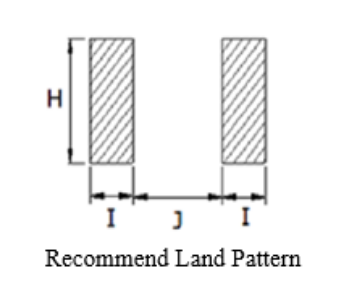
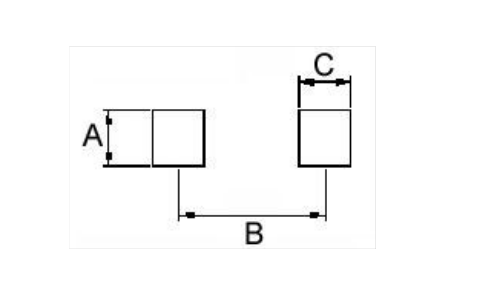
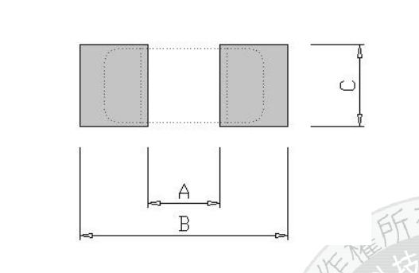

# gen_inductor.py
## Usage
`python gen_inductor.py <inputfile.yaml> <outputPath>`

## Intent
The goal is to allow easy copy and paste, or at least direct transcription, from datasheet tables, rather than requiring
users to calculate a certain style of dimensions.
Being able to easily compare the transcribed metadata files and the source datasheets both reduces errors
at creation time, but also eases review.

The workflow that has worked well for me is as follows
1. Use Foxit PDF to copy the specifications table.
1. Paste this in the spreadsheet editor of your choice
1. Delete the columns which aren't required
1. Rename the headers and perform any other editing or grouping required (eg. regex `# ±[\d\. ]*` is useful to match tolerances and delete)
1. Export to CSV format

## YAML input file
A YAML file is used to define common properties of a series of parts.
You should use a single YAML file per vendor, to make it easier to track changes.
The intent is that the YAML file is shared with the [`kicad-packages3D-generator`](https://gitlab.com/kicad/libraries/kicad-packages3D-generator/)
repository, so some of the information might seem irrelevant here, but it allows capturing
a single source.

**Note** All dimensions are specified in mm.

- `series`: Name of the series
- `manufacturer`: Name of the series
- `datasheet`: Optional. URL of the datasheet. If you do not specify it here, then **make sure to specify it** in the CSV.
- `csv`: Filename of metadata, see below for structure.  Should be a path relative to the YAML file.
- `3d`: Optional.  This section is unused in _this_ repository, but is used by the 3d generators, so you should try and fill it in.
    - `type`: Optional. 
        * 1 - Rectangle body, rectangle pads on the bottom surface. For stronger rounded corners, set `cornerRadius` below.
        * 2 - Rectangle body, rectangle pads on the bottom surface, with visible wings on the sides
        
    - `bodyColor`: Optional. Default to `black body`.
    - `pinColor`: Optional. Default to `metal grey pins`
    - `padThickness`: Optional. Default to `0.05` mm.
    - `cornerRadius`: Optional. Default to 5% of the smallest side.
    - `padSpacing`: Optional. Defaults to `none`, which means pads are at the physical edge of the component. Use `edge` for edge-to-edge spacing 
    for physical pads, or `center` if datasheet uses center-to-center dimensions.
- `tags`: Optional. The word `inductor` as a tag is included already in the script. You should add the series name.

## CSV input files
The CSV metadata files for each series can have the data columns in any order,
to allow as much flexibility in copying directly from the datasheet.

### Required Fields
* `PartNumber` - Part number that will be generated. This could be the unique part number,
or you can perform grouping if there are multiple parts sharing the same footprint.
* `lengthY` - physical dimensions of the inductor.
* `widthX` - physical dimensions of the inductor.
* `height` - physical dimensions of the inductor.

### Pad dimensions
`padX` and `padY` - the dimensions of the actual pad on the component
`padSpacing` - the spacing between the actual pads

These are used to make 3d models.

### Land spacing dimensions
These are (at least) three common ways of describing these in datasheets,
and this generator supports entering all three forms as literally as possible,
to avoid transcription errors.
Various columns are available to provide what information you have,
the script will automatically determine the rest if possible.

For the stye of inductors this script supports, this means you must provide `landingY`,
and then any two of the following:
* `landingX` - the actual X dimension for the copper land
* `landingInsideX` - the X distance between the inside edges of the two lands
* `landingOutsideX` - the X distance between the outside edges of the two lands
* `landingSpacingX` - the X distance between the centers of the two lands

(No guarantees that all plausible combinations are actually supported :smile:)

#### Style "inside edge"

For this style, you should provide:
* `landingX` - here, dimension I
* `landingY` - here, dimension H
* `landingInsideX` - here, dimension J

#### Style "centered"

For this style, you should provide:
* `landingX` - here, dimension C
* `landingY` - here, dimension A
* `landingSpacingX` - here, dimension B

#### Style "outside edge"

For this style, you should provide:

* `landingY` - here, dimension C
* `landingInsideX` - here, dimension A 
* `landingOutsideX` - here, dimension B

### Optional fields

`datasheet` - If your parts have unique datasheets per part, specify them here. Please use quotes for this column.
This will override a datasheet specified for the series.

## Example

In this example from the Sunlord SWPA series, the recommended land pattern is in the proper orientation (pads on the left/right) for this script.
- `A` is `widthX`
- `B` is `lengthY`
- `F` is `padSpacing`
- `E` is `padX`
- `D` is `padY`
- `b` becomes `landingX`
- `c` is `landingY`
- `a` is `landingInsideX`

In this datasheet, care must be taken to adjust the physical dimensions. Notice that `A` is X
since the land pattern is rotated to differ from the physical drawings.

